# List Of All Logos
Generated using `./tools/render_all.sh`, powered by [typst](https://typst.app)
## alma
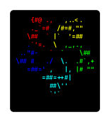

## alpine
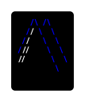

## android
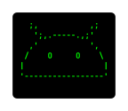

## amogos
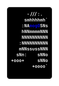

## arch
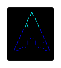

## arco
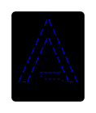

## artix
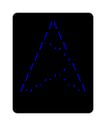

## bazzite
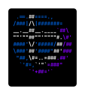

## bedrock
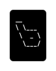

## buildroot

## cachyos
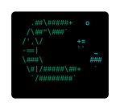

## celos
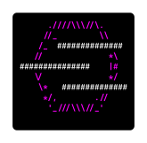

## centos
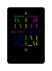

## crystallinux
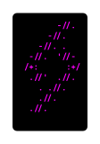

## dahlia
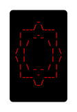

## debian
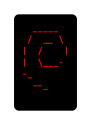

## devuan
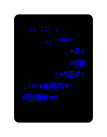

## dietpi
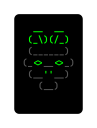

## dragonfly
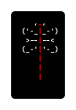

## elementary
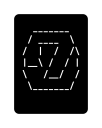

## endeavour
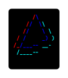

## fedora

## fiwix
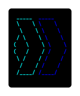

## freebsd
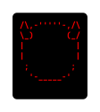

## garuda
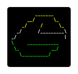

## gentoo
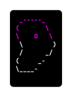

## gnu
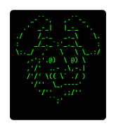

## guix
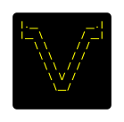

## haiku
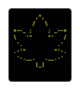

## hydroOS
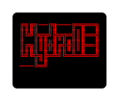

## hyperbola

## iglunix
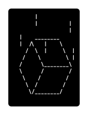

## instantos

## irix
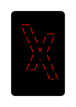

## kdeneon
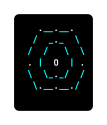

## linuxlite
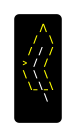

## linuxmint
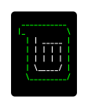

## linux
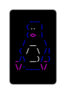

## macos
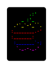

## mageia
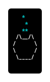

## manjaro
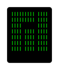

## morphos
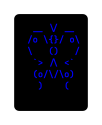

## minix
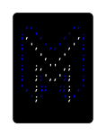

## mx

## netbsd
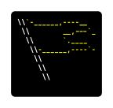

## nima
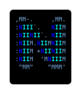

## nixos
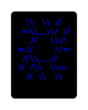

## nobara
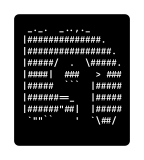

## openbsd
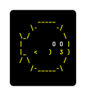

## opensusetumbleweed
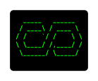

## opensuse
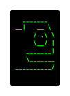

## openwrt
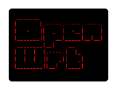

## oracle
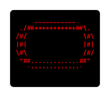

## parabola
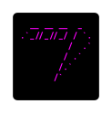

## pop!_os
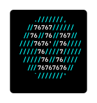

## pureos

## raspbian

## rocky

## serenityos

## slackware

## solus

## steamos

## solaris

## ubuntu

## vanilla

## void

## windows

## xeonix

